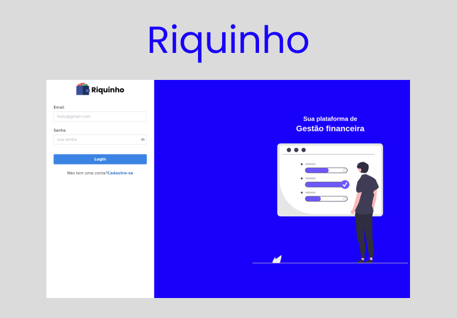

<p align="center">
  
</p>

## 💻 Projeto

O riquinho é uma plataforma para controle financeiro, baseada em receitas e despesas, com o obejtivo de introduzir essa prática em pessoas com pouco ou nenhum conhecimento sobre finanças e educação financeira

## 🚀 Tecnologias

Esse projeto foi desenvolvido com as seguintes tecnologias:

- React
- Typescript
- NestJS
- Typeorm
- JWT

## 🤌 Executando o Projeto

### Front-end

Utilize o **npm install** para instalar as dependências do projeto.
Em seguida, inicie o projeto.

```cl
npm run dev
```

### Backend

O projeto utiliza um banco de dados Postgres como provider

Para subir o container docker do banco basta executar 

```cl
dokcer compose up -d
```

Caso não tenha docker, ou deseje utilizar o proprio postgres, basta criar um banco de dados com as mesmas credenciais que constam no **.env.developmente**

Utilize o **npm install** para instalar as dependências do projeto.
Em seguida, execute as migrations do banco de dados e após isso inicie o projeto.

```cl
npm run migration:run
```

```cl
npm run start:dev
```

Pronto agora só acessar a aplicação e testar, boa noite meu jovem!